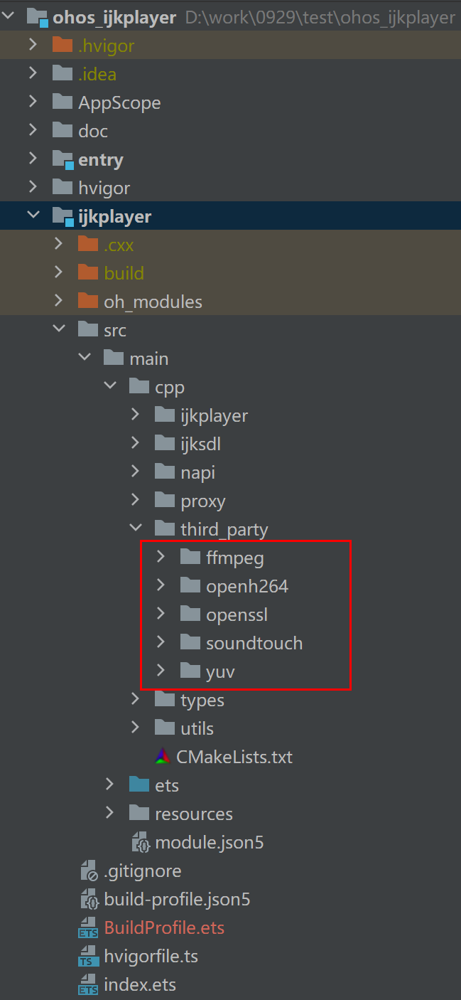

# ijkplayer

## 简介
>  ijkplayer是OpenHarmony环境下可用的一款基于FFmpeg的视频播放器。

## 演示


## 编译运行

### ffmpeg soundtouch yuv openh264依赖

1. FFmpeg:基于B站的FFmpeg版本(ff4.0--ijk0.8.8--20210426--001):[FFmpeg源码链接](https://github.com/bilibili/FFmpeg/tags)， [FFmpeg](https://gitee.com/openharmony-sig/tpc_c_cplusplus/tree/support_x86/thirdparty/FFmpeg-ff4.0)可以在交叉编译出库文件和头文件，编译可参考[FFmpeg-ff4.0编译指导](https://gitcode.com/openharmony-sig/tpc_c_cplusplus/blob/support_x86/thirdparty/FFmpeg-ff4.0/README_zh.md)。

   1. 编译成功后会在lycium\usr生成FFmpeg-ff4.0文件夹改名为ffmpeg。

2. soudtouch:基于B站的soudtouch版本(ijk-r0.1.2-dev):[soundtouch源码链接](https://github.com/bilibili/soundtouch/branches) ，soundtouch须在交叉编译出库文件和头文件。

   1. 把doc目录下的soundtouch-ijk文件夹拷贝到thirdparty下在lycium文件夹执行./build.sh soundtouch-ijk可以在lycium\usr目录下编译出soundtouch的静态库和头文件

3. yuv:基于B站的yuv版本(ijk-r0.2.1-dev):[yuv源码链接](https://github.com/bilibili/libyuv/branches)，yuv须在交叉编译出库文件和头文件。
   1. 把doc目录下的libyuv-ijk文件夹拷贝到thirdparty下在lycium文件夹执行./build.sh libyuv-ijk可以在lycium\usr目录下编译出yuv的静态库和头文件

4. openh264:基于版本(openh264-2.4.1):[openh264源码链接](https://github.com/cisco/openh264/releases),openh264须在交叉编译出库文件和头文件。编译脚本可参考[openh264](https://gitcode.com/openharmony-sig/tpc_c_cplusplus/blob/support_x86/thirdparty/openh264)。编译完成后，输出文件在lycium\usr目录下openh264文件夹。    

5. 把编译生成的ffmpeg文件夹拷贝到ijkplayer/src/main/cpp/third_party/ffmpeg下

6. 把编译生成的openssl、soundtouch、yuv、openh264的文件夹，拷贝到工程的ijkplayer/src/main/cpp/third_party下，如图所示：



### IDE编译运行

1、通过IDE工具下载依赖SDK，Tools->SDK Manager->OpenHarmony SDK 把native选项勾上下载，API版本>=9

2、开发板选择RK3568，[ROM下载地址](http://ci.openharmony.cn/workbench/cicd/dailybuild/dailylist). 选择开发板类型是rk3568，请使用最新的版本

3、使用git clone下载源码，不要直接通过gitee网页的方式下载

## 下载安装
```shell
ohpm install @ohos/ijkplayer
```
## 使用说明
```
   import { IjkMediaPlayer } from "@ohos/ijkplayer";
   import type { OnPreparedListener } from "@ohos/ijkplayer";
   import type { OnVideoSizeChangedListener } from "@ohos/ijkplayer";
   import type { OnCompletionListener } from "@ohos/ijkplayer";
   import type { OnBufferingUpdateListener } from "@ohos/ijkplayer";
   import type { OnErrorListener } from "@ohos/ijkplayer";
   import type { OnInfoListener } from "@ohos/ijkplayer";
   import type { OnSeekCompleteListener } from "@ohos/ijkplayer";
   import { LogUtils } from "@ohos/ijkplayer";
```
### 在UI中配置XComponent控件
```
    XComponent({
      id: 'xcomponentId',
      type: 'surface',
      libraryname: 'ijkplayer_napi'
    })
    .onLoad((context) => {
      this.initDelayPlay(context);
     })
     .onDestroy(() => {
     })
     .width('100%')
     .aspectRatio(this.aspRatio)
```

### 播放
```
    //单例模式
    let mIjkMediaPlayer = IjkMediaPlayer.getInstance();
    //多实例模式
    let mIjkMediaPlayer = new IjkMediaPlayer();
    // 如果播放视频，调用setContext接口，参数1为XComponent回调的context， 可选参数2为XComponent的id属性值
    mIjkMediaPlayer.setContext(this.mContext, "xcomponentId");
    // 如果只播放音频，则调用setAudioId接口，参数为音频对象的id
    // mIjkMediaPlayer.setAudioId('audioIjkId');
    // 设置debug模式
    mIjkMediaPlayer.setDebug(true);
    // 初始化配置
    mIjkMediaPlayer.native_setup();
    // 设置视频源
    mIjkMediaPlayer.setDataSource(url); 
    // 设置视频源http请求头
    let headers =  new Map([
      ["user_agent", "Mozilla/5.0 BiliDroid/7.30.0 (bbcallen@gmail.com)"],
      ["referer", "https://www.bilibili.com"]
    ]);
    mIjkMediaPlayer.setDataSourceHeader(headers);
    // 使用精确寻帧 例如，拖动播放后，会寻找最近的关键帧进行播放，很有可能关键帧的位置不是拖动后的位置，而是较前的位置.可以设置这个参数来解决问题
    mIjkMediaPlayer.setOption(IjkMediaPlayer.OPT_CATEGORY_PLAYER, "enable-accurate-seek", "1");
    // 预读数据的缓冲区大小
    mIjkMediaPlayer.setOption(IjkMediaPlayer.OPT_CATEGORY_PLAYER, "max-buffer-size", "102400");
    // 停止预读的最小帧数
    mIjkMediaPlayer.setOption(IjkMediaPlayer.OPT_CATEGORY_PLAYER, "min-frames", "100");
    // 启动预加载
    mIjkMediaPlayer.setOption(IjkMediaPlayer.OPT_CATEGORY_PLAYER, "start-on-prepared", "1");
    // 设置无缓冲，这是播放器的缓冲区，有数据就播放
    mIjkMediaPlayer.setOption(IjkMediaPlayer.OPT_CATEGORY_PLAYER, "packet-buffering", "0");
    // 跳帧处理,放CPU处理较慢时，进行跳帧处理，保证播放流程，画面和声音同步
    mIjkMediaPlayer.setOption(IjkMediaPlayer.OPT_CATEGORY_PLAYER, "framedrop", "5");
    // 最大缓冲cache是3s， 有时候网络波动，会突然在短时间内收到好几秒的数据
    // 因此需要播放器丢包，才不会累积延时
    // 这个和第三个参数packet-buffering无关。
    mIjkMediaPlayer.setOption(IjkMediaPlayer.OPT_CATEGORY_PLAYER, "max_cached_duration", "3000");
    // 无限制收流
    mIjkMediaPlayer.setOption(IjkMediaPlayer.OPT_CATEGORY_PLAYER, "infbuf", "1");
    // 屏幕常亮
    mIjkMediaPlayer.setScreenOnWhilePlaying(true);
    // 设置超时
    mIjkMediaPlayer.setOption(IjkMediaPlayer.OPT_CATEGORY_FORMAT, "timeout", "10000000");
    mIjkMediaPlayer.setOption(IjkMediaPlayer.OPT_CATEGORY_FORMAT, "connect_timeout", "10000000");
    mIjkMediaPlayer.setOption(IjkMediaPlayer.OPT_CATEGORY_FORMAT, "listen_timeout", "10000000");
    mIjkMediaPlayer.setOption(IjkMediaPlayer.OPT_CATEGORY_FORMAT, "addrinfo_timeout", "10000000");
    mIjkMediaPlayer.setOption(IjkMediaPlayer.OPT_CATEGORY_FORMAT, "dns_cache_timeout", "10000000");
    
    let mOnVideoSizeChangedListener: OnVideoSizeChangedListener = {
      onVideoSizeChanged(width: number, height: number, sar_num: number, sar_den: number) {
        that.aspRatio = width / height;
        LogUtils.getInstance()
          .LOGI("setOnVideoSizeChangedListener-->go:" + width + "," + height + "," + sar_num + "," + sar_den)
        that.hideLoadIng();
      }
    }
    mIjkMediaPlayer.setOnVideoSizeChangedListener(mOnVideoSizeChangedListener);
    let mOnPreparedListener: OnPreparedListener = {
      onPrepared() {
        LogUtils.getInstance().LOGI("setOnPreparedListener-->go");
      }
    }
    mIjkMediaPlayer.setOnPreparedListener(mOnPreparedListener);

    let mOnCompletionListener: OnCompletionListener = {
      onCompletion() {
        LogUtils.getInstance().LOGI("OnCompletionListener-->go")
        that.currentTime = that.stringForTime(mIjkMediaPlayer.getDuration());
        that.progressValue = PROGRESS_MAX_VALUE;
        that.stop();
      }
    }
    mIjkMediaPlayer.setOnCompletionListener(mOnCompletionListener);

    let mOnBufferingUpdateListener: OnBufferingUpdateListener = {
      onBufferingUpdate(percent: number) {
        LogUtils.getInstance().LOGI("OnBufferingUpdateListener-->go:" + percent)
      }
    }
    mIjkMediaPlayer.setOnBufferingUpdateListener(mOnBufferingUpdateListener);

    let mOnSeekCompleteListener: OnSeekCompleteListener = {
      onSeekComplete() {
        LogUtils.getInstance().LOGI("OnSeekCompleteListener-->go")
        that.startPlayOrResumePlay();
      }
    }
    mIjkMediaPlayer.setOnSeekCompleteListener(mOnSeekCompleteListener);

    let mOnInfoListener: OnInfoListener = {
      onInfo(what: number, extra: number) {
        LogUtils.getInstance().LOGI("OnInfoListener-->go:" + what + "===" + extra)
      }
    }
    mIjkMediaPlayer.setOnInfoListener(mOnInfoListener);

    let mOnErrorListener: OnErrorListener = {
      onError(what: number, extra: number) {
        LogUtils.getInstance().LOGI("OnErrorListener-->go:" + what + "===" + extra)
        that.hideLoadIng();
        prompt.showToast({
          message:"亲，视频播放异常，系统开小差咯"
        });
      }
    }
    mIjkMediaPlayer.setOnErrorListener(mOnErrorListener);

    mIjkMediaPlayer.setMessageListener();

    mIjkMediaPlayer.prepareAsync();

    mIjkMediaPlayer.start();
```
### 暂停
```
   mIjkMediaPlayer.pause();
```
### 停止
```
   mIjkMediaPlayer.stop();
```
### 重置
```
   mIjkMediaPlayer.reset();
```
### 释放
```
   mIjkMediaPlayer.release();
```
### 快进、后退
```
   mIjkMediaPlayer.seekTo(msec);
```
### 倍数播放
```
   mIjkMediaPlayer.setOption(IjkMediaPlayer.OPT_CATEGORY_PLAYER, "soundtouch", "1");
   mIjkMediaPlayer.setSpeed("2f");
```
### 屏幕常亮
```
   mIjkMediaPlayer.setScreenOnWhilePlaying(true);
```
### 循环播放
```
   mIjkMediaPlayer.setLoopCount(true);
```
### 设置音量
```
   mIjkMediaPlayer.setVolume(leftVolume, rightVolume);
```
### 音频焦点监控
```
   import { InterruptEvent, InterruptHintType } from '@ohos/ijkplayer/src/main/ets/ijkplayer/IjkMediaPlayer';
   import { Callback } from '@ohos.base';
   // 音频焦点变化回调处理
   let event:  Callback<InterruptEvent> = (event) => {
     console.info(`event: ${JSON.stringify(event)}`);
     if (event.hintType === InterruptHintType.INTERRUPT_HINT_PAUSE) {
       this.pause();
     } else if (event.hintType === InterruptHintType.INTERRUPT_HINT_RESUME) {
       this.startPlayOrResumePlay();
     } else if (event.hintType === InterruptHintType.INTERRUPT_HINT_STOP) {
       this.stop();
     }
   }
   // 设置监听音频中断事件
   mIjkMediaPlayer.on('audioInterrupt', event);

   // 取消订阅音频中断事件
   mIjkMediaPlayer.off('audioInterrupt');
```

### 开启硬解码
```
   // 开启h264与h265硬解码
   ijkMediaPlayer.setOption(IjkMediaPlayer.OPT_CATEGORY_PLAYER, "mediacodec-all-videos", "1");
   // 开启h265硬解码
   ijkMediaPlayer.setOption(IjkMediaPlayer.OPT_CATEGORY_PLAYER, "mediacodec-hevc", "1");
```


### 开启视频录制
```
    let recordSaveFilePath = getContext(this).cacheDir + "/record.mp4";
    let result = this.mIjkMediaPlayer.startRecord(recordSaveFilePath);
    prompt.showToast({
      message: result ? "开启录制成功" : "开启录制失败"
    });
```

### 获取视频录制状态
```
    let isRecord = this.mIjkMediaPlayer.isRecord();
    prompt.showToast({
      message: isRecord ? "正在录制中" : "录制没有开启哦！"
    });
```

### 停止视频录制
```
    // 保存相册需要申请权限: ohos.permission.WRITE_IMAGEVIDEO
    this.mIjkMediaPlayer.stopRecord().then((result) => {
      if(!result){
        prompt.showToast({
          message: "停止录制失败"
        });
        return;
      }
      let atManager = abilityAccessCtrl.createAtManager();
      atManager.requestPermissionsFromUser(getContext(that), ['ohos.permission.WRITE_IMAGEVIDEO']).then(async () => {
        let photoType: photoAccessHelper.PhotoType = photoAccessHelper.PhotoType.VIDEO;
        let extension:string = 'mp4';
        let options: photoAccessHelper.CreateOptions = {
          title: "record_"+new Date().getTime()+""
        }
        let phAccessHelper = photoAccessHelper.getPhotoAccessHelper(getContext(that));
        phAccessHelper.createAsset(photoType, extension, options, (err, uri) => {
          if (uri !== undefined) {
            let recordFile = fs.openSync(that.recordSaveFilePath);
            let albumFile = fs.openSync(uri,fs.OpenMode.READ_WRITE);
            fs.copyFileSync(recordFile.fd,albumFile.fd);
            fs.closeSync(recordFile);
            fs.closeSync(albumFile);
            prompt.showToast({
              message: "停止录制成功"
            });
          } else {
            prompt.showToast({
              message: "停止录制失败"
            });
          }
        });
      })
    })
```

### 截屏
```
    // 保存相册需要申请权限: ohos.permission.WRITE_IMAGEVIDEO
    let saveFilePath = getContext(this).cacheDir + "/screen.jpg";
    this.mIjkMediaPlayer.screenshot(saveFilePath).then((result) => {
      if(!result) {
        prompt.showToast({
          message: "截屏失败"
        });
        return;
      }
      let atManager = abilityAccessCtrl.createAtManager();
      atManager.requestPermissionsFromUser(getContext(that), ['ohos.permission.WRITE_IMAGEVIDEO']).then(async () => {
        let photoType: photoAccessHelper.PhotoType = photoAccessHelper.PhotoType.IMAGE;
        let extension:string = 'jpg';
        let options: photoAccessHelper.CreateOptions = {
          title: "screenshot_"+new Date().getTime()+""
        }
        let phAccessHelper = photoAccessHelper.getPhotoAccessHelper(getContext(that));
        phAccessHelper.createAsset(photoType, extension, options, (err, uri) => {
          if (uri !== undefined) {
            let screenshotFile = fs.openSync(saveFilePath);
            let albumFile = fs.openSync(uri,fs.OpenMode.READ_WRITE);
            fs.copyFileSync(screenshotFile.fd,albumFile.fd);
            fs.closeSync(screenshotFile);
            fs.closeSync(albumFile);
            prompt.showToast({
              message: "截屏成功"
            });
          } else {
            prompt.showToast({
              message: "截屏失败"
            });
          }
        });
      })
    });
```

### 音频设备断开和连接监控
```
   import { InterruptEvent, InterruptHintType } from '@ohos/ijkplayer/src/main/ets/ijkplayer/IjkMediaPlayer';
   import { Callback } from '@ohos.base';
   // 音频设备断连回调处理
   let deviceChangeEvent: Callback<InterruptEvent> = (event) => {
      LogUtils.getInstance().LOGI(`deviceChange event: ${JSON.stringify(event)}`);
      if (event.reason === DeviceChangeReason.REASON_NEW_DEVICE_AVAILABLE) { // 音频设备连接
        this.pause();
      } else if (event.reason === DeviceChangeReason.REASON_OLD_DEVICE_UNAVAILABLE) { // 音频设备断开连接
        this.pause();
      } 
    }
    // 订阅音频设备断开和连接事件
    this.mIjkMediaPlayer.on('deviceChange', deviceChangeEvent);

   // 取消订阅音频设备断开和连接事件
   mIjkMediaPlayer.off('audioInterrupt');
```

### hls起播优化
```
// 开启hls起播优化 默认是关闭的
this.mIjkMediaPlayer.setOption(IjkMediaPlayer.OPT_CATEGORY_FORMAT, "fetch_first", "on");
```

## 接口说明

### IjkMediaPlayer.getInstance()
| 接口名                           | 参数                                                           | 返回值               | 说明                                                           |
|-------------------------------|--------------------------------------------------------------|-------------------|--------------------------------------------------------------|
| setContext                    | context: object, id?: string                                 | void              | 设置XComponent回调的context, 设置XComponent的id属性值(可选), 播放视频时需要调用该接口 |
| setDebug                      | open: boolean                                                | void              | 设置日志开关                                                       |
| native_setup                  | 无                                                            | void              | 初始化配置                                                        |
| setDataSource                 | url: string                                                  | void              | 设置视频源地址                                                      |
| setDataSourceHeader           | headers: Map<string, string>                                 | void              | 设置视频源的HTTP请求头                                                |
| setOption                     | category:string, key: string, value: string                  | void              | 设置播放前预设参数(用于设置char类型参数)                                      |
| setOptionLong                 | category:string, key: string, value: string                  | void              | 设置播放前预设参数(用于设置int类型参数)                                       |
| prepareAsync                  | 无                                                            | void              | 加载视频                                                         |
| start                         | 无                                                            | void              | 播放视频                                                         |
| stop                          | 无                                                            | void              | 停止播放                                                         |
| pause                         | 无                                                            | void              | 暂停播放                                                         |
| reset                         | 无                                                            | void              | 视频重置                                                         | 
| release                       | 无                                                            | void              | 释放资源                                                         |
| seekTo                        | msec： string                                                 | void              | 快进、后退                                                        |
| setScreenOnWhilePlaying       | on: boolean                                                  | void              | 设置屏幕常亮                                                       |
| setSpeed                      | speed: string                                                | void              | 设置播放倍数                                                       |
| getSpeed                      | 无                                                            | number            | 获取设置的倍数                                                      |
| isPlaying                     | 无                                                            | boolean           | 查看是否正在播放状态                                                   |
| setOnVideoSizeChangedListener | listener: OnVideoSizeChangedListener                         | void              | 设置获取视频宽高回调监听                                                 |
| setOnPreparedListener         | listener: OnPreparedListener                                 | void              | 设置视频准备就绪回调监听                                                 |
| setOnInfoListener             | listener: OnInfoListener                                     | void              | 设置播放器的各种状态回调监听                                               |
| setOnErrorListener            | listener: OnErrorListener                                    | void              | 设置播放异常回调监听                                                   |
| setOnBufferingUpdateListener  | listener: OnBufferingUpdateListener                          | void              | 设置buffer缓冲回调监听                                               |
| setOnSeekCompleteListener     | listener: OnSeekCompleteListener                             | void              | 设置快进后退回调监听                                                   |
| setMessageListener            | 无                                                            | void              | 设置视频监听器到napi用于接收回调                                           |
| getVideoWidth                 | 无                                                            | number            | 获取视频宽度                                                       |
| getVideoHeight                | 无                                                            | number            | 获取视频高度                                                       |
| getVideoSarNum                | 无                                                            | number            | 获取视频宽高比的分子                                                   |
| getVideoSarDen                | 无                                                            | number            | 获取视频宽高比的分母                                                   |
| getDuration                   | 无                                                            | number            | 获取视频总的时长                                                     |
| getCurrentPosition            | 无                                                            | number            | 获取视频播放当前位置                                                   |
| getAudioSessionId             | 无                                                            | number            | 获取音频sessionID                                                |
| setVolume                     | leftVolume: string,rightVolume:string                        | void              | 设置音量                                                         |
| setLoopCount                  | looping: boolean                                             | void              | 设置循环播放                                                       |
| isLooping                     | 无                                                            | boolean           | 查看当前是否循环播放                                                   |
| selectTrack                   | track: string                                                | void              | 选择轨道                                                         |
| deselectTrack                 | track: string                                                | void              | 删除选择轨道                                                       |
| getMediaInfo                  | 无                                                            | object            | 获取媒体信息                                                       |
| setAudioId                    | id: string                                                   | void              | 设置创建音频对象，设置id                                                |
| on                            | type: ‘audioInterrupt’, callback: Callback< InterruptEvent > | void              | 监听音频中断事件，使用callback方式返回结果                                    |
| on                            | type: ‘deviceChange’, callback: Callback< InterruptEvent >     | void             | 监听音频设备断开和连接事件，使用callback方式返回结果                                    |
| off                           | type: ‘audioInterrupt’                                       | void              | 取消订阅音频中断事件                                                   |
| off                           | type: ‘deviceChange’                                       | void              | 取消订阅音频断开和连接事件                                                   |
| startRecord                           | saveFilePath: string                                       | boolean              | 开启视频录制                                                  |
| isRecord                           | 无                                      | boolean              | 获取视频录制状态                                                  |
| stopRecord                           | 无                                      | Promise<boolean>              | 停止视频录制                                                  |
| screenshot                           | saveFilePath: string                                      | Promise<boolean>               | 截屏                                                  |
### 参数说明
1.	InterruptEvent
播放中断时，应用接收的中断事件。

| 名称      | 类型               | 必填 | 说明                                 |
|-----------|--------------------|------|--------------------------------------|
| forceType | InterruptForceType | 是   | 操作是由系统执行或是由应用程序执行。 |
| hintType  | InterruptHint      | 是   | 中断提示。                           |

2.	InterruptForceType
枚举，强制打断类型。

| 名称            | 值 | 说明                                 |
|-----------------|----|--------------------------------------|
| INTERRUPT_FORCE | 0  | 由系统进行操作，强制打断音频播放。   |
| INTERRUPT_SHARE | 1  | 由应用进行操作，可以选择打断或忽略。 |

3.	InterruptHint
枚举，中断提示。

| 名称                  | 值 | 说明                                         |
|-----------------------|----|----------------------------------------------|
| INTERRUPT_HINT_NONE   | 0  | 无提示。                                     |
| INTERRUPT_HINT_RESUME | 1  | 提示音频恢复。                               |
| INTERRUPT_HINT_PAUSE  | 2  | 提示音频暂停。                               |
| INTERRUPT_HINT_STOP   | 3  | 提示音频停止。                               |
| INTERRUPT_HINT_DUCK   | 4  | 提示音频躲避。（躲避：音量减弱，而不会停止） |
| INTERRUPT_HINT_UNDUCK | 5  | 提示音量恢复。                               |

## 关于混淆
- 代码混淆，请查看[代码混淆简介](https://docs.openharmony.cn/pages/v5.0/zh-cn/application-dev/arkts-utils/source-obfuscation.md)
- 如果希望ijkplayer库在代码混淆过程中不会被混淆，需要在混淆规则配置文件obfuscation-rules.txt中添加相应的排除规则：
```
-keep
./oh_modules/@ohos/ijkplayer
```

## 约束与限制

在下述版本验证通过：
- DevEco Studio: NEXT Beta1-5.0.3.806, SDK: API12 Release (5.0.0.66)
- DevEco Studio NEXT 5.0（5.0.3.427）--SDK:API12

 监听音频中断事件需保证设备系统版本在22以上。
 设置音量需保证SDK版本在12及以上。

## 目录结构

```javascript
|---- ijkplayer  
|     |---- entry  # 示例代码文件夹
|     |---- ijkplayer  # ijkplayer 库文件夹
|			|---- cpp  # native模块
|                  |----- ijkplayer # ijkplayer内部业务
|                  |----- ijksdl    # ijkplayer内部业务
|                  |----- napi      # 封装NAPI接口
|                  |----- proxy     # 代理提供给NAPI调用处理ijkplayer内部业务
|                  |----- third_party #三方库依赖 
|                  |----- utils     #工具
|            |---- ets  # ets接口模块
|                  |----- callback  #视频回调接口
|                  |----- common    #常量
|                  |----- utils     #工具  
|                  |----- IjkMediaPlayer.ets #ijkplayer暴露的napi调用接口
|     |---- README_zh.MD  # 安装使用方法                   
```

## 贡献代码

使用过程中发现任何问题都可以提[Issue](https://gitcode.com/openharmony-sig/ohos_ijkplayer/issues) 给组件，当然，也非常欢迎发[PR](https://gitcode.com/openharmony-sig/ohos_ijkplayer/pulls)共建。

## 开源协议

本项目基于 [LGPLv2.1 or later](LICENSE)，请自由地享受和参与开源。


